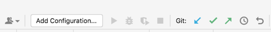
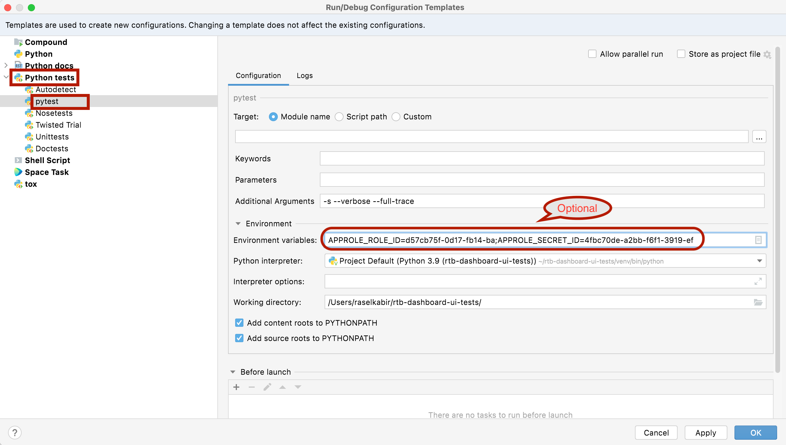

# DSP API tests
We need to cover our DSP API system flows with automation tests. 

This is a test project written in `python3`.

To run this first clone this repo in your machine. Create a virtual environment with `venv`. Give these following commands to set up the environment:

```
$python3 -m venv venv
$source venv/bin/activate
$pip install -r requirements.txt
```

## Credentials
For connecting to mysql from local we use Eskimi VPN_**. Please contact SRE for credential issues.

Need access permission for the following vault path also:

1.`rtb/approle/dsp-dashboard-ui-test-(user)`

## Local Debugging (Terminal)
Clone this repository.

Create your local configuration file first with the following command:
```
$cp local.ini.dist local.ini
```
Edit your local configuration (`local.ini`) accordingly.

The tests are run using `pytest` in xdist. To run the tests run the following command after activating the `venv`:
```
$ python -m pytest -s --durations=0 --verbose -n 5
```

This will create 5 pytest sessions in which the tests will start in parallel. 

For debugging each test individually, run it like this from your terminal.
```
$ python -m pytest tests/test_{FILE_NAME}.py::test_{TEST_NAME} -s --verbose
```

## Local Debugging (PyCharm)

For generating run configurations run the following command to collect the list of available tests.

```
$ APPROLE_ROLE_ID={YOUR-VAULT-ROLE-ID} APPROLE_SECRET_ID={YOUR-VAULT-SECRET} python -m pytest --collect-only
```

Copy and format the output to `_tools/runconfig_generator/_test_list.txt` file.

Run the following script to generate run configurations:

```
$ APPROLE_ROLE_ID={YOUR-VAULT-ROLE-ID} APPROLE_SECRET_ID={YOUR-VAULT-SECRET} python _tools/runconfig_generator/runconfig_gen.py
```

Then copy them to your project run configurations folder.

```
$cp _tools/runconfig_generator/confs/* .idea/runConfigurations/
```

You'll be able to debug the tests from your IDE now with all the run configurations available.

**_In case facing any issue on the above steps just follow the following steps to make it manually_**

`Step 1: Click on the 'Add Configuration' button at the top right corner of your 'PyCharm'`



`Step 2: Now from the 'Run/Debug Configurations' pop up, click on the 'Edit configurations template' button`

`Step 3: Expand the 'Python tests' and select 'pytest' option -->  Now fill up the form with the help of following 
image:`

**Note:** **'Environment variables' and 'Working directory' field values will be user specific**



Now it's all set for you!!!

**To run any specific test case, just set the cursor anywhere in the test case and press 'control+shift+R' to start running it**
